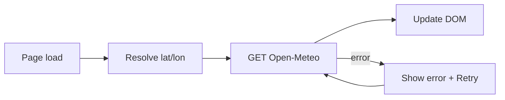

# Weather bento card

## Context

Your site is a **vanilla HTML/CSS/JS** bento portfolio (`[bento-portfolio/index.html](bento-portfolio/index.html)`, `[bento-portfolio/js/main.js](bento-portfolio/js/main.js)`), aligned with `[Bento portfolio spec.md](Bento portfolio spec.md)`. The new feature is a **bento grid card** (your chosen placement), not a separate app shell.

## Data source

Use **[Open-Meteo](https://open-meteo.com/)** (free, no API key, HTTPS, works from the browser with `fetch`):

- **Forecast endpoint** with `latitude`, `longitude`, and fields such as `current`, `daily` (or `hourly` for a compact next-few-hours strip).
- **Default location**: Cali, Colombia (~`3.4516`,` -76.5320`) to match the sidebar line “Cali, Colombia”.
- **Optional**: `navigator.geolocation.getCurrentPosition` to center the widget on the visitor; on denial or error, keep Cali as fallback.

No backend or env secrets are required, which fits a static GitHub Pages–style deploy.

## UI behavior (MVP)

| State   | Behavior                                                                                                                         |
| ------- | -------------------------------------------------------------------------------------------------------------------------------- |
| Loading | Skeleton or subtle placeholder text inside the card (reuse existing `--color-text-muted`, card padding).                         |
| Success | City label, current temperature, short condition text, optional high/low or a **horizontal strip** of 5–7 daily or hourly pills. |
| Error   | Short message + **Retry** button (`type="button"`) that re-runs the fetch.                                                       |

Map Open-Meteo **WMO weather codes** to short labels and optional emoji/SVG icons (single small module or object map in JS—no new dependency).

Keep copy consistent with the page: `**lang="es"`** on `[index.html](bento-portfolio/index.html)` suggests Spanish strings for condition labels and errors (“No se pudo cargar el clima”, etc.).

## Layout integration

Add a **new row** under the existing row 3 (projects + right column):

- Introduce a class e.g. `.card-weather` with `**grid-column: 1 / -1`** and `**grid-row: 4`** so the weather card spans the full bento width on desktop—room for temperature + mini forecast without crushing the two-column cards above.

Update `[bento-portfolio/css/layout.css](bento-portfolio/css/layout.css)`:

- Assign `.card-weather` to row 4, full span.
- In the `max-width: 900px` block, add `.card-weather` alongside the other cards so it becomes a single-column stack like the rest.

## Files to touch

| File                                                                       | Role                                                                                                                                                                                                                                                                                                                |
| -------------------------------------------------------------------------- | ------------------------------------------------------------------------------------------------------------------------------------------------------------------------------------------------------------------------------------------------------------------------------------------------------------------- |
| `[bento-portfolio/index.html](bento-portfolio/index.html)`                 | Markup for the card: heading, region for current stats, container for forecast strip, retry control, `aria-live` for dynamic updates.                                                                                                                                                                               |
| `[bento-portfolio/css/components.css](bento-portfolio/css/components.css)` | `.card-weather` layout (flex/grid), typography using existing `--font-display` / `--font-body`, borders/shadows consistent with `.card` / `.social-card`.                                                                                                                                                           |
| `[bento-portfolio/css/tokens.css](bento-portfolio/css/tokens.css)`         | Only if you need one or two **semantic** tokens (e.g. a soft accent for “warm” highlight)—optional; prefer reusing existing colors first.                                                                                                                                                                           |
| `[bento-portfolio/js/weather.js](bento-portfolio/js/weather.js)` (new)     | Fetch, parse, WMO mapping, geolocation optional, DOM updates, retry.                                                                                                                                                                                                                                                |
| `[bento-portfolio/js/main.js](bento-portfolio/js/main.js)`                 | Either a one-line import is **not** available in plain script tags—load `weather.js` with a second `<script defer src="js/weather.js">` after `main.js`, or init from `main.js` if you prefer a single file (slightly larger `main.js`). **Recommendation**: separate `weather.js` + second script tag for clarity. |

## Accessibility

- The weather block should be a **named region** (`aria-labelledby` pointing to a visible heading, e.g. “Clima”).
- Use `**aria-live="polite"`** on the container that receives temperature/conditions after load.
- Ensure **Retry** is keyboard-focusable and does not navigate away.

## Architecture (data flow)

## Out of scope (unless you ask later)

- City search / arbitrary locations (adds UI complexity and possibly geocoding).
- OpenWeatherMap or other key-based APIs (would require a proxy or exposed keys on a static site).
- Framework migration or bundler.

## Verification

- Open `index.html` locally or via static server; confirm network calls succeed, loading/error/success states, and responsive layout at 900px and 480px breakpoints.
- Test with geolocation denied: should still show Cali.

